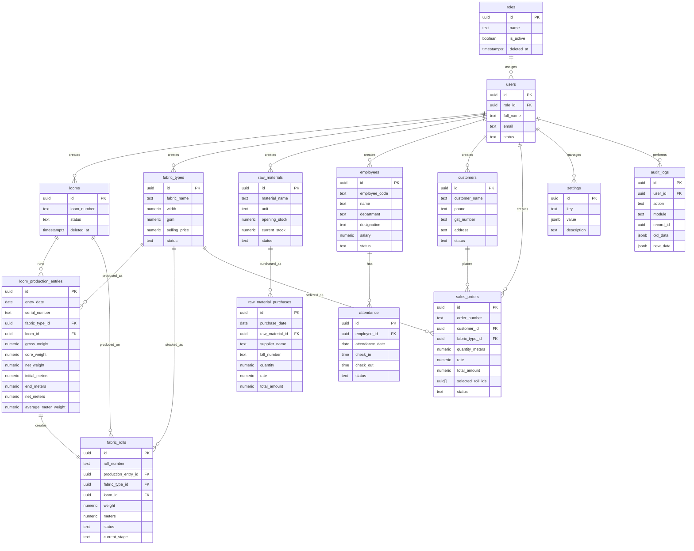

# ER Diagram

```mermaid
erDiagram
  roles ||--o{ users : assigns
  users ||--o{ looms : creates
  users ||--o{ fabric_types : creates
  users ||--o{ raw_materials : creates
  raw_materials ||--o{ raw_material_purchases : purchased_as
  users ||--o{ employees : creates
  employees ||--o{ attendance : has
  users ||--o{ customers : creates
  fabric_types ||--o{ loom_production_entries : produced_as
  looms ||--o{ loom_production_entries : runs
  loom_production_entries ||--|| fabric_rolls : creates
  fabric_types ||--o{ fabric_rolls : stocked_as
  looms ||--o{ fabric_rolls : produced_on
  customers ||--o{ sales_orders : places
  fabric_types ||--o{ sales_orders : ordered_as
  users ||--o{ sales_orders : creates
  users ||--o{ settings : manages
  users ||--o{ audit_logs : performs

  roles {
    uuid id PK
    text name
    boolean is_active
    timestamptz deleted_at
  }
  users {
    uuid id PK
    uuid role_id FK
    text full_name
    text email
    text status
  }
  looms {
    uuid id PK
    text loom_number
    text status
    timestamptz deleted_at
  }
  fabric_types {
    uuid id PK
    text fabric_name
    numeric width
    numeric gsm
    numeric selling_price
    text status
  }
  raw_materials {
    uuid id PK
    text material_name
    text unit
    numeric opening_stock
    numeric current_stock
    text status
  }
  raw_material_purchases {
    uuid id PK
    date purchase_date
    uuid raw_material_id FK
    text supplier_name
    text bill_number
    numeric quantity
    numeric rate
    numeric total_amount
  }
  employees {
    uuid id PK
    text employee_code
    text name
    text department
    text designation
    numeric salary
    text status
  }
  attendance {
    uuid id PK
    uuid employee_id FK
    date attendance_date
    time check_in
    time check_out
    text status
  }
  customers {
    uuid id PK
    text customer_name
    text phone
    text gst_number
    text address
    text status
  }
  loom_production_entries {
    uuid id PK
    date entry_date
    text serial_number
    uuid fabric_type_id FK
    uuid loom_id FK
    numeric gross_weight
    numeric core_weight
    numeric net_weight
    numeric initial_meters
    numeric end_meters
    numeric net_meters
    numeric average_meter_weight
  }
  fabric_rolls {
    uuid id PK
    text roll_number
    uuid production_entry_id FK
    uuid fabric_type_id FK
    uuid loom_id FK
    numeric weight
    numeric meters
    text status
    text current_stage
  }
  sales_orders {
    uuid id PK
    text order_number
    uuid customer_id FK
    uuid fabric_type_id FK
    numeric quantity_meters
    numeric rate
    numeric total_amount
    uuid[] selected_roll_ids
    text status
  }
  settings {
    uuid id PK
    text key
    jsonb value
    text description
  }
  audit_logs {
    uuid id PK
    uuid user_id FK
    text action
    text module
    uuid record_id
    jsonb old_data
    jsonb new_data
  }
```
